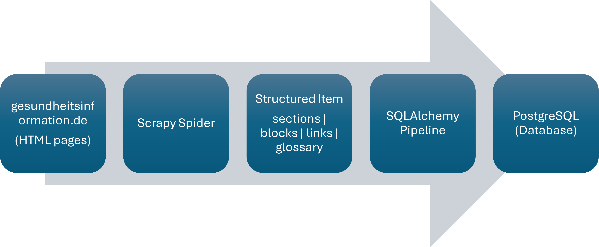
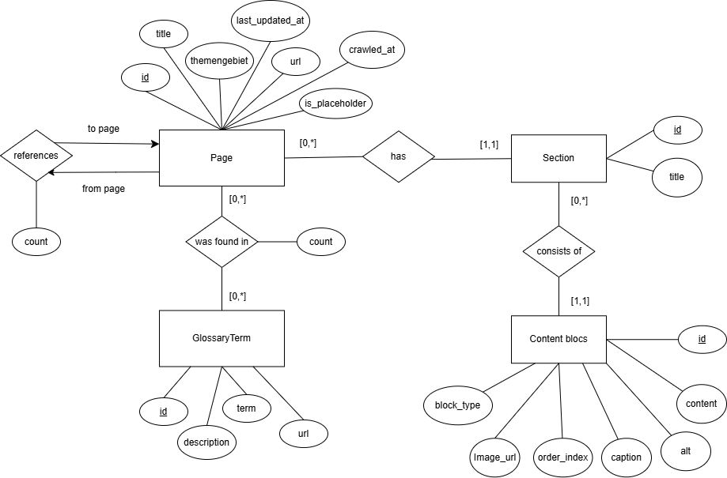
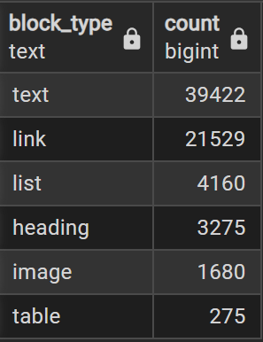
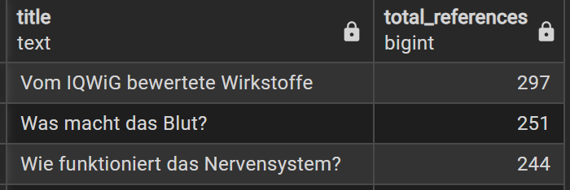
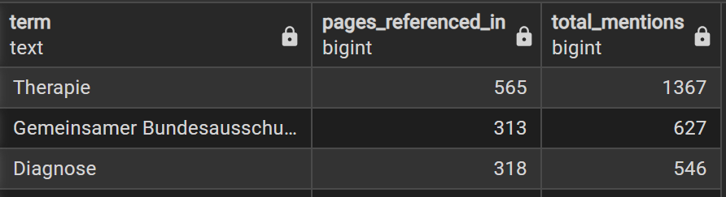

# Crawler for Gesundheitsinformation.de

Beginners Practical\
Winter Term 2025/26\
Polina Degtyarenko (polina.degtyarenko@stud.uni-heidelberg.de)

## Motivation

The website [gesundheitsinformation.de](https://www.gesundheitsinformation.de/) is a German health information portal that provides evidence-based medical knowledge to inform public in matters of health. The content is structured into thematic areas, individual health topics, explanatory sections etc. In addition, pages are heavily interlinked, so that different articles reference other topic pages to ptovide broader context and deeper explanations.

From a data perspective, this structure makes the website non-trivial to crawl and model. It is not simply a collection of independent pages, but rather a dense hierarchical network of interconnected health topics.

The aim of this practical is therefore not merely to extract text from web pages, but to reconstruct the semantic structure and store it in a relational database in such a way as to preserve:

- the hierarchical structure of pages and sections;
- the order and type of content elements;
- the network of internal links between pages;
- and the references to medical glossary terms.

This results in a **relational Database** of medical content that can later be used for applications such as search, question answering, knowledge graphs, or Retrieval-Augmented Generation systems.

## Data

The crawler targets the website: 
[www.gesundheitsinformation.de](https://www.gesundheitsinformation.de/)

The content there is organized hierarchically:
1. **Themengebiete** (topic areas)
2. **A-Z pages** (Alphabetical topic index)
3. Individual **topic pages**

Each page has simmilar visual structure:
- A main title - **h1** header
- Multiple sections (e.g. Einleitung, Symptome, Ursachen etc.) introduced by **h2** headers
- Subheadings **h3**
- Paragraphs of content text
- Lists and tables
- Images
- Internal links to other topic pages
- Glossary references

Although this structure appears intuitive to a reader, it is **not represented as simple containers** in the HTML. Instead relevant content elements are distributed across different tags and nested structures, making naive scraping insufficient.

## Exploration & Challenges
Before implementing the crawler, I manually inspected several topic pages to understand how different semantic elements are represented in the DOM. This exploration revealed a number of challenges.

### Section Boundaries
Sections are visually introduced by **h2** elements. However, the content belonging to a section is not wrapped inside a single parent container. Instead, all elements of a section are descendants of the surrounding \<article> node. Therefore, the crawler must:
- identify an h2,
- find its ancestor \<article>
- and collect all relevant descendant nodes in the correct order until next h2.

Consequently, a context-dependent DOM traversal was required, rather than a simple CSS selection.

### Heterogeneous Content Elements

Within a section, content can appear in many different forms:
- paragraphs (**p**)
- subheadings (**h3**)
- lists (**ul**)
- tables inside wrapper divs
- images inside media containers
- figures inside the introduction area

All of these elements must be detected, recognized and stored, while preserving the **order of appearance**.

### Glossary References

Glossary terms are not ordinary links. Instead, they appear as:

```python
<span class="glossaryLink" data-title="..." data-desc="..." data-link="...">
```
Here the visible text does not directly contain the glossary description. Instead, the term, its explanation and link to the glossary page are hidden in HTML attributes. Which means that extractin those we need to inspect attributes rather than text content.

### Links to other Pages

Topic pages contain many links, but not all of them a relevant to us. In this project:
- internal links to other topic pages should be followed and counted;
- links to glossary pages should be treated separately;
- links to thematic overview pagesshould be ignored;
- external links should be ignored.

These conditions requires careful URL filtering and classification.

### Content Ordering

To be able to reconstruct pages later, it was crucial to store content elements in the exact order in which they appear on the page. The DOM hierarchy does not provided this ordering so it must be tracked manually during parsing.

### Date Parsing

The *last updated* date is provided as German text (e.g., _Aktualisiert am 20. März 2024_). Which requires custom parsing logic to convert it into a structured date format.

## Architecture and Crawling Pipeline

To transorm HTML pages of gesundheitsinformation.de into a structured relational database, we implemented a multi-stage processing pipeline. It separates crawling, reconstruction of page content and database storage into clearly defined stages. Where each stage performs a specific transformation of the data, converting raw HTML into a relational representation of the website's content.

The pipeline is based on [Scrapy](https://www.scrapy.org/) for crawling and [SQLAlchemy](https://www.sqlalchemy.org/) for structured storage in a [PostgreSQL](https://www.postgresql.org/) database.



### Crawling

To run a full crawl of the website execute:

```python
scrapy crawl gesundheitsinfo
```

The crawling process begins at the overview of thematic areas: https://www.gesundheitsinformation.de/themengebiete/ .

From there spider navigates to the alphabetical pages ("Themen von A bis Z") and then to individual topic pages.

Whenever a topic page is visited, all internal links to other topic pages are extracted and followed recursively. To prevent revisiting pages the spider maintains a set of already visited URLs.

The linkst should satisfy following rules to be followed:
- to belong to the gesundheitsinformation.de domain;
- to end with **.html**;
- not to be a glossary link;
- not to lead to navigation or overview pages.

This ensures that the crawler explores only semantically relevant medical topic pages, while gradually discovering the entire site structure. 

### Test Mode for Targeted Crawling

During development, a test mode was implemented to allow crawling of a single specified topic page instead of the entire website. It is particularly useful for debugging parsing logic, validating section detection, and testing database insertions without executing a full crawl. It significantly reduces development time and enables controlled experimentation with specific pages.

To run the spider in test mode for a specific page execute:

```python
scrapy crawl gesundheitsinfo -a test_url="https://www.gesundheitsinformation.de/beispiel.html"
```


### Content Reconstruction

On of the key tasks of the spider is to reconstruct the semantic structure of pages from the HTML DOM.

For each topic page, the spider extracts:
- Page title;
- Thematic area (themengebiet);
- Last update date;
- All content sections;
- All content elements in correct order;
- Internal link frequencies;
- References to glossary terms.

This representation captures the meaning and hierarchy of the page and serves as the interface between crawling and storage.

### Content Blocks Inside Sections

Sections are identified by **h2** elements. However, the content belonging to a section is not wrapped inside a dedicated container. Therefore, the spider traverse the DOM relative to each h2 and classify descendant nodes according to their semantic role.

We detect the following content types:

| HTML pattern | Block type         |
|--------------|--------------------|
| Paragraphs (**p**) | text |
| Subheadings (**h3**) | heading
| Lists (**ul > li**) | list|
| Tables inside wrapper divs | table |
| Images inside media containers | image |
| Links inside paragraphs | link |

To allow later reconstruction of the page, each block receives an **order_index** to preserve the exact order of appearance.

### Transformation to Database

The structured item produced by the spider is passed to the SQLAlchemy pipeline, which is responsible for inserting and updating database entries.

For each processed page, the pipeline:
- Creates the page if it does not exist yet;
- Updates placeholder pages that were previously discovered via links;
- Inserts sections and content blocks only if they are new;
- Aggregates links counts between pages;
- Creates glossary terms once and links them to multiple pages.

### Building a Page Graph

While parsing content, the spider counts how often each internal link appears on the page. These counts are stored in the database as directed edges between pages.

If a linked page has not yet been crawled, it is inserted as a placeholder page. Once the page is visited, the placeholder is replaced with actual content.

This mechanism results in a graph representation of the entire website, even before all pages have been crawled.

## Database Schema

To achieve the goal of this practical, a dedicated data model was designed in PostgreSQL using SQLAlchemy as ORM layer.

The database schema reflects the semantic structure of the website and allows pages, sections, content elements, links and glossary terms to be represented as interconnected entities.



The structure of the database can be represented by the following relations:

**has**((page_id) → Page, (<u>id</u>) → Section)

**consists_of**((section_id) → Section, (<u>id</u>) → ContentBlock)

**was_found_in**(count, (<u>page_id</u>) → Page, (<u>glossary_term_id</u>) → GlossaryTerm)

**references**(count, (<u>from_page_id</u>) → Page, (<u>to_page_id</u>) → Page)

Pages consist of ordered sections, sections consist of semantic content blocks, pages reference glossary concepts, and pages reference each other through directed links. This relational view highlights the transformation of the website into a structured database.


## Results and Capabilities of the System

### Size of a Database

After the crawling process, the crawler database contains **2761 pages** extracted from the website.

Across these pages, the crawler identified **13097 sections** containing a total of **70998 content blocks**.

### Distribution of Content Types
Because each element of a section is classified during crawling, it is possible to analyze how information is presented across the entire website.



The distribution of block types shows how information is presented across the platform.
The high number of textual blocks reflects the explanatory nature of the website, while the presence of lists, tables, and media elements indicates structured medical information rather than simple narrative text.

### Most Referenced Topic Pages

By storing links between pages together with their frequency, the crawler implicitly builds a directed graph of the website.

The following pages are most frequently referenced by other topic pages.



The page *„Vom IQWiG bewertete Wirkstoffe“* serves as a central reference hub, likely because it aggregates evaluations of multiple pharmaceutical substances. Its high number of incoming references suggests that many disease-specific pages link to it when discussing medication or treatment options.

### Glossary Vocabulary

In total, our crawler identified **435 unique glossary terms** across all topic pages.

Because glossary terms are linked to pages with reference counters, we can analyze their usage.



This information can be used to indicate core medical concepts that appear throughout many different topics.

### Why These Statistics are Important

Because pages, sections, content blocks, links, and glossary terms are stored relationally, the system enables:

- identification of central topics within the site
- analysis of conceptual importance via glossary usage
- structural comparison between pages
- reconstruction of the original page hierarchy
- graph-based analysis of topic interconnections

In other words, the database is now a structured representation of medical knowledge that can be queried and analyzed from multiple perspectives.


## Conclusion

In this practical we developed a structured web crawling pipeline to transform the semi-structured HTML content of *gesundheitsinformation.de* into a relational database.

The implemented architecture separates crawling, semantic reconstruction, and database storage into clearly defined stages. This design enables incremental crawling, avoids duplication and results it in a structured, queryable representation.

However, the current analysis focuses primarily on structural statistics. More advanced graph-theoretic or semantic analyses remain future work. Additionally, the crawler relies on the current DOM structure of the website and may require adaptation if the layout changes.

Despite these limitations, the project shows that semi-structured medical web content can be systematically transformed into a structured knowledge graph using a modular crawling pipeline. The resulting system provides a solid foundation for further analytical or retrieval-based applications built on top of the extracted data.

## Tools

The project is implemented entirely in Python and builds upon several specialized libraries for web crawling, HTML parsing, database interaction, and data processing listed below.

- Python 3.11
- Scrapy 2.13.4: web crawling framework
- SQLAlchemy 2.0.44: ORM for database interaction
- PostgreSQL: relational database system

## Reuse

Code in this repository is provided for academic use within this practical.
Crawled content originates from the target website(https://www.gesundheitsinformation.de) and remains subject to the original website’s copyright and terms of use.

Feel free to contact me in case of any
questions: polina.degtyarenko@stud.uni-heidelberg.de
